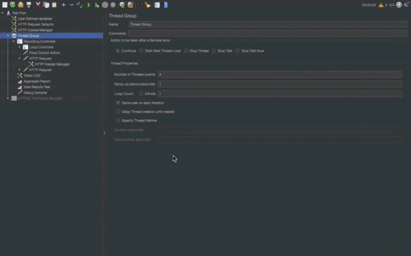
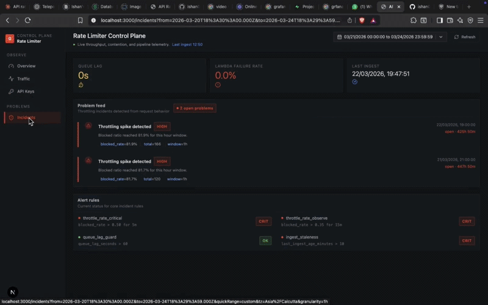

# API Rate Limiter Dashboard

Operator-facing rate limiter + observability dashboard built with Next.js, Redis token bucket logic, SQS async logging, Lambda ingestion, and Postgres analytics.

## Demo

### Operator Dashboard


### Rate Limiter in Action


## Why This Project

This project models a real production pattern for API platforms:

- enforce rate limits in a fast middleware path
- avoid hot-path database writes
- ship decision logs asynchronously to a worker pipeline
- expose operational visibility (throughput, blocked traffic, key pressure, pipeline health)

## Architecture

```text
Client Request
  -> Next.js Middleware (token bucket via Upstash Redis)
      -> allow/deny + rate-limit headers
      -> async usage event to SQS
          -> Lambda worker consumes batch
              -> Prisma writes UsageLog + BlockedRequest
                  -> Dashboard APIs query Postgres
                      -> React dashboard (overview, traffic, keys, incidents)
```

## Tech Stack

- Frontend: Next.js App Router, React 19, Tailwind CSS, React Query, Recharts, TanStack Table
- Rate limiting: Upstash Redis + Lua token bucket
- Async pipeline: AWS SQS + Lambda
- Database: Neon Postgres + Prisma
- Infra: SST
- Tooling: TypeScript, ESLint, Prettier

## Core Features

- API-key aware rate limiting (IP fallback when key is absent)
- Standard limit headers on responses (`X-RateLimit-*`, `Retry-After`)
- SQS-based async request outcome logging (`200` / `429`)
- Lambda batch ingestion with partial failure handling
- Dashboard pages: Overview, API Keys, Traffic, Incidents
- Pipeline health widget support (queue lag + ingest freshness)

## Monorepo Structure

```text
apps/frontend   Next.js app, middleware, dashboard UI, dashboard APIs
apps/backend    Prisma schema, worker service, backend scripts
packages/*      shared workspace packages
sst.config.ts   infrastructure definition (SQS, DLQ, Lambda subscription)
```

## Local Setup

### 1) Prerequisites

- Node.js `>=20.9.0`
- npm
- Postgres database (Neon recommended)
- Upstash Redis
- AWS credentials + SQS queue URL

### 2) Install dependencies

```bash
npm install
```

### 3) Environment

Copy `.env.example` and set values used by middleware + worker + dashboard queries.

Required variables include:

- `DATABASE_URL`
- `DIRECT_URL`
- `UPSTASH_REDIS_REST_URL`
- `UPSTASH_REDIS_REST_TOKEN`
- `AWS_REGION`
- `AWS_ACCESS_KEY_ID`
- `AWS_SECRET_ACCESS_KEY`
- `SQS_QUEUE_URL`

### 4) Prisma

```bash
npm run prisma:generate --workspace @api-rate-limiter-dashboard/backend
npm run prisma:migrate:dev --workspace @api-rate-limiter-dashboard/backend
```

### 5) Run frontend

```bash
npm run dev:frontend
```

The app runs at `http://localhost:3000`.

## Useful Commands

```bash
npm run dev:frontend
npm run build
npm run lint
npm run typecheck
npm run sst:deploy
npm run sst:remove
```

## JMeter Testing Notes

- Send `Authorization: Bearer <token>` from JMeter.
- Ensure the token path in the middleware and ingestion flow maps to a valid `ApiKey` identity in DB.
- Stress the same endpoint with loops/threads to trigger `429` responses.
- Validate:
  - response headers show limit/reset values
  - dashboard metrics update
  - worker persists `UsageLog` and `BlockedRequest`

## Deployment and Cost Control

Use SST for infra lifecycle:

```bash
npm run sst:deploy
npm run sst:remove
```

## Repository Status

This repository is designed as a portfolio artifact showcasing:

- production-style rate limiting architecture
- async observability pipeline design
- operational dashboard UX

